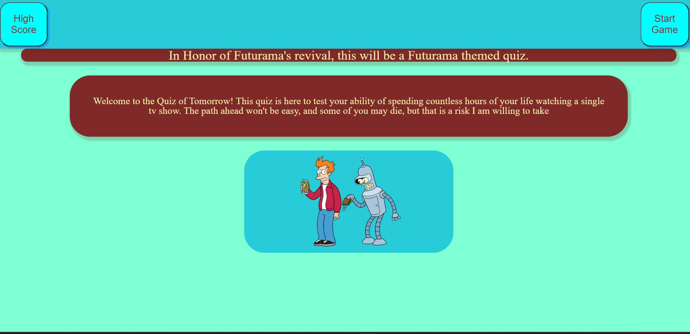
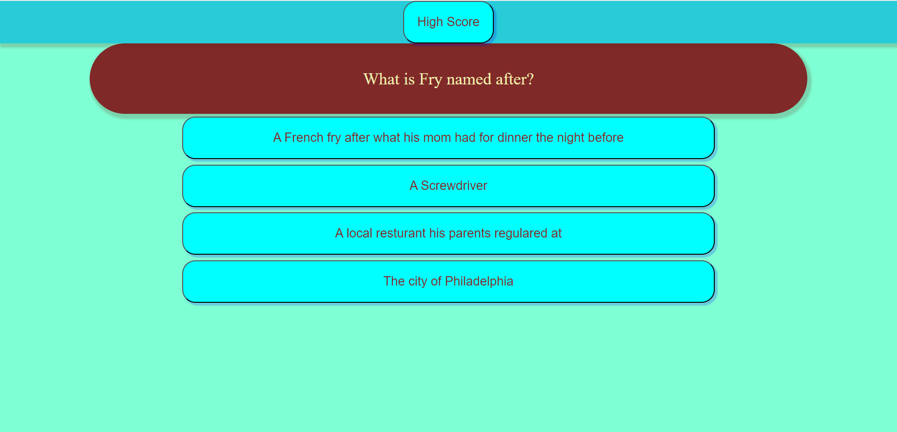
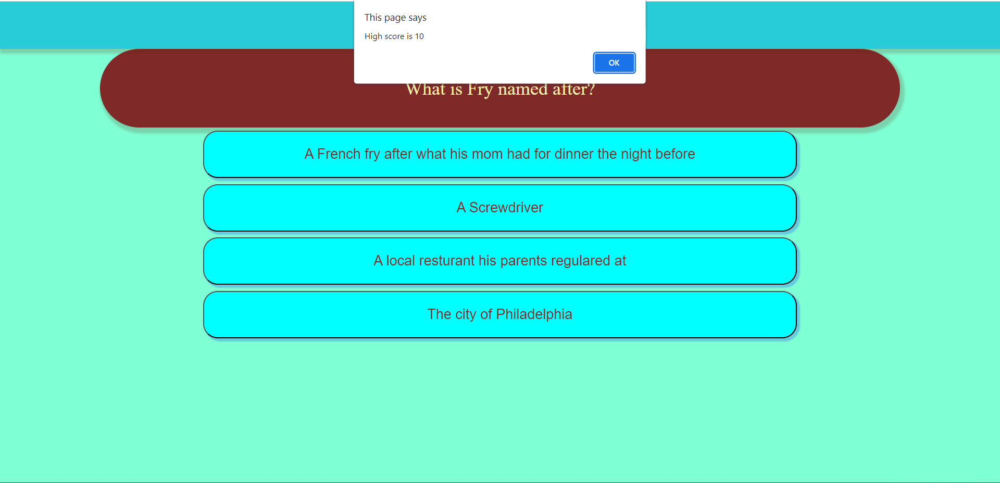

# QuizTime

## Description

This web page is designed to test your knowledge of Futurama, while demenstrating a few different features in Javascript. Click the start button to get the quiz started, check your highscore at any time to make sure that you are on pace to become a real Futurama Trivia Junkie

## User information
Click start and proceed to the questions. For the questions, just click whatever answer you feel is correct. The button will then indicate whether you got the question correct or incorrect, by lighting up green or red respectively. Whenever you complete the quiz, it will store your best score in local storage and save it in the highscore button. See if you can get a perfect 10/10, and also make sure to play around with how many questions you get right, see what kind of answers change.
## Links

Link to Repository
https://github.com/ccoff1798/QuizTime

Deployed Site
https://ccoff1798.github.io/QuizTime/

## Screenshot

## Credits

This project is a solo project, credit to the creators of the piece of artwork that is Futurama